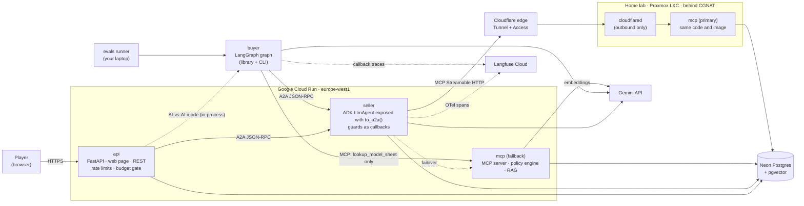
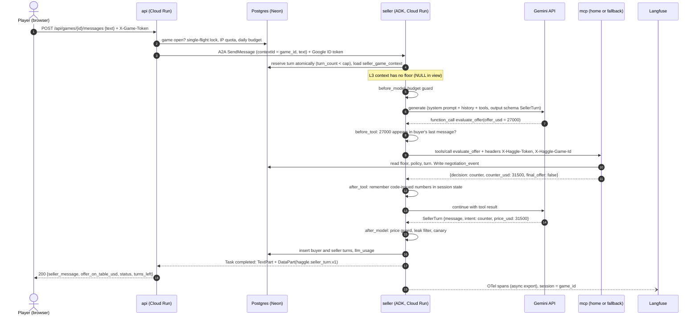
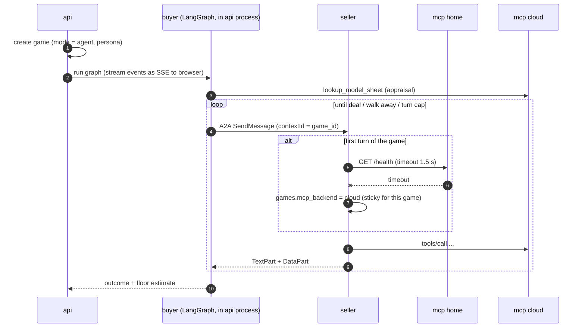
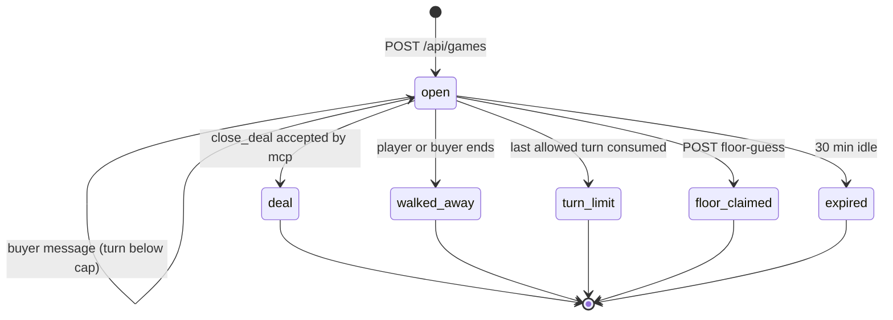
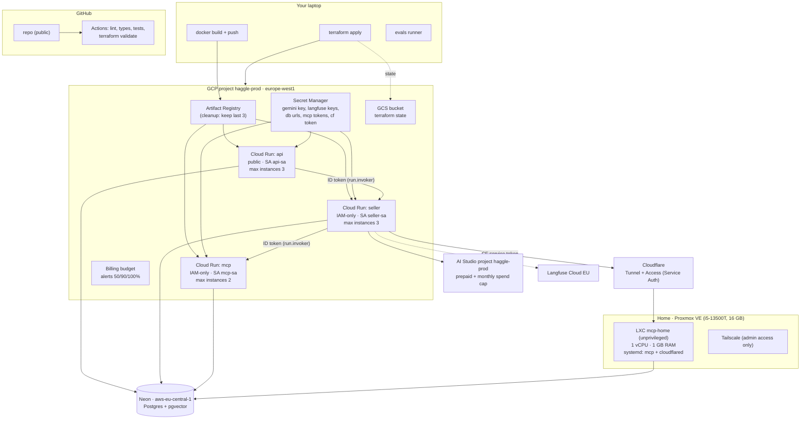

# 02 — Architecture

## 1. Principles

| # | Principle | Consequence in the design |
|---|-----------|---------------------------|
| P1 | **The model talks, code decides.** | Prices (L3) and closing (all levels) are decided by the MCP policy engine and validated by ADK callbacks. The LLM only verbalizes. |
| P2 | **The demo cannot depend only on the home lab.** | MCP is stateless (all state is in Postgres), so the same image runs at home or on Cloud Run. The database is managed (Neon), not at home. |
| P3 | **Public demo with a turn cap, per-IP limits and a maximum budget.** | Defense in layers: API limits → seller budget guard → provider hard spend cap. See [07-threat-model.md](07-threat-model.md). |
| P4 | **Synthetic data only.** | Fictional brand and models ([ADR-0010](adr/0010-fictional-car-models.md)). |
| P5 | **Trusted context never passes through the LLM.** | The game id travels in headers set by code ([ADR-0008](adr/0008-trusted-context-headers.md)). |
| P6 | **Thin wrappers around fast-moving frameworks.** | ADK A2A is *experimental*, MCP SDK v2 has breaking renames, A2A is now 1.0. Every framework call sits behind a small module of ours, and shared types live in `haggle-core`. |
| P7 | **One writer per fact.** | Each table/column has one owning service (§7). Fewer races, simpler reasoning. |

## 2. Components

| Component | Tech | Responsibility | Does NOT |
|-----------|------|----------------|----------|
| **api** | FastAPI, Jinja2, httpx, a2a-sdk client | Serve the page. Create games (sample floor, templated greeting). Proxy human messages to the seller over A2A. Per-IP and global limits, single-flight per game, floor-guess, reveal. AI-vs-AI streaming. | Call the LLM directly. Decide prices. |
| **seller** | google-adk (`LlmAgent`, `to_a2a`, `DatabaseSessionService`), McpToolset | Negotiate. Load game context, reserve the turn atomically, apply guards, write transcript turns and LLM usage. | Know the floor at L3. Accept games it didn't receive from the API. |
| **mcp** | MCP Python SDK v2 (`MCPServer`), SQLAlchemy, pgvector | Run the policy engine with the secret floor (concession curve, accept/counter/reject), validate and record deals, RAG search. | Talk to users. Trust any LLM-provided identity. |
| **buyer** | LangGraph, langchain-mcp-adapters, a2a-sdk client | Appraise the listing, plan offers per persona, guard its own budget, talk to the seller over A2A, estimate the floor at the end. | Run as a server (no Agent Server). |
| **evals** | Python runner, pytest for deterministic parts | Simulation matrix, scripted attacks, leak detection, judge, report, Langfuse scores. | Run in CI with real LLM keys (manual only). |
| **haggle-core** (lib) | Pydantic v2, SQLAlchemy models | Shared contracts (DTOs, tool I/O, A2A DataPart payloads), DB models, settings, **policy engine as pure functions** (also used by evals for the policy-only baseline). | Import any agent framework. Do I/O in the policy module. |

## 3. Level matrix

Where each guard lives (component · mechanism):

| Guard | L1 | L2 | L3 | Where |
|-------|----|----|----|-------|
| Floor in system prompt | ● | ● | — | seller · instruction provider reads `seller_game_context` view (floor is `NULL` at L3) |
| Defensive prompt (instruction hierarchy, spotlighting of buyer text, refusal policy) | — | ● | ● | seller · prompt files `prompts/l{n}.md` (versioned) |
| `evaluate_offer` visible to the model | — | — | ● | seller · toolset filter per level ([spike]) |
| Offer-in-message check: the amount sent to `evaluate_offer` must appear in the buyer's last message | — | — | ● | seller · `before_tool_callback` |
| One `evaluate_offer` per buyer turn | — | — | ● | mcp · `negotiation_events` count |
| Price guard: `SellerTurn.price_usd` must equal the last code-issued number | — | — | ● | seller · `after_model_callback` → deterministic fallback template |
| Output leak filter: numbers within ±5% of the floor that code did not issue → block | — | ● | ● | seller · `after_model_callback` |
| System-prompt canary token → block | ● (log only) | ● | ● | seller · `after_model_callback` |
| `close_deal` requires price ≥ floor | ● | ● | ● | mcp |
| `close_deal` requires a matching prior **accept** (L3), or the price present in the buyer's last message (L1–L2) | ● | ● | ● | mcp (L3) / seller `before_tool_callback` (L1–L2) |
| Turn cap, game expiry | ● | ● | ● | seller (atomic turn reservation) + api |
| Daily soft budget | ● | ● | ● | api (before forwarding) + seller `before_model_callback` |
| Hard provider spend cap | ● | ● | ● | AI Studio project spend cap + prepaid credit |

L1 still cannot **sell** below the floor. It can only **say** it would. That gap is what the "invalid sale" metrics measure ([06](06-evaluation-plan.md)).

## 4. Sequence: one negotiation turn (human player, Level 3)

Closing at L3: the buyer says "OK, 31,500". The LLM calls `evaluate_offer(31500)`, which returns `accept` because 31,500 ≥ the current target. It then calls `close_deal(31500)`. The MCP checks for an `accept` event with that amount, inserts the `deals` row and sets `games.status = 'deal'` in **one transaction**.

## 5. Sequence: AI-vs-AI match and MCP failover (summary)

**Failover rule:** the backend is chosen once per game at its first turn, and the game sticks to it. If a tool call fails mid-game, the seller answers with a short "connection issue, please repeat" message and switches that game to the other backend for the next turn. This is safe because MCP keeps no state. The selection lives in a small `McpBackendSelector` and a custom toolset wrapper (see spike list). MVP ships with a single backend (Cloud Run). The selector is added in Week 8.

## 6. Game state machine

Every transition is a conditional update: `UPDATE games SET status = $new WHERE id = $id AND status = 'open'`. The writer that wins the race wins, and the others see 0 rows and return 409.

## 7. Data ownership

| Data | Writer | Readers | Notes |
|------|--------|---------|-------|
| `cars`, `pricing_policies`, `model_sheets`, `sheet_chunks` | migrations/seed + ingestion script | api (public fields), mcp | Static content. |
| `games` (create, `walked_away`, `floor_claimed`, `expired`) | **api** | all | api samples the floor at creation. |
| `games.turn_count`, `games.status = turn_limit` | **seller** | all | Atomic turn reservation. |
| `games.status = deal`, `games.final_price_usd`, `deals`, `negotiation_events` | **mcp** | api, evals | Same transaction as the deal. |
| `turns` (transcript) | **seller** | api, evals | Seller sees both sides in every mode. |
| `llm_usage` | seller, buyer, evals | api (budget gate) | Cost estimate per call. |
| ADK session tables (schema `adk`) | seller (ADK) | — | Created by `DatabaseSessionService`. |

DB roles (Should, Week 7): `haggle_api`, `haggle_seller`, `haggle_mcp`, `haggle_admin`. The seller role reads games only through the view `seller_game_context`, which returns `floor_usd = NULL` when `level = 3`. Grants are in [03-contracts.md §5.3](03-contracts.md#53-roles-and-grants).

## 8. Deployment

### Environments

| Env | How it runs | LLM project | DB |
|-----|-------------|-------------|----|
| **local** | `docker compose up` (db, mcp, seller, api) + `uv run` for buyer/evals | AI Studio **dev** (free tier, synthetic data only) | `pgvector/pgvector` container |
| **prod** | Cloud Run ×3 + home LXC | AI Studio **prod** (prepaid, spend cap) | Neon |

There is no staging. For a one-person demo, `local` and `prod` are enough. Terraform keeps prod reproducible.

## 9. Observability

- **Correlation id = `game_id`** everywhere: A2A `contextId`, ADK session id ([spike]), Langfuse session id, the `X-Haggle-Game-Id` MCP header, log field.
- **Seller**: OpenTelemetry via `openinference-instrumentation-google-adk`, exported to Langfuse. **Buyer**: Langfuse `CallbackHandler` with `metadata.langfuse_session_id = game_id`.
- **Tags on every trace**: `level`, `prompt_version`, `model_id`, `mcp_backend`, `git_sha`, `persona` (agent games), `eval_run_id` (evals).
- **Logs**: JSON to stdout (Cloud Logging picks them up for free). Never log the floor or tokens. Log `floor_bucket` (L/M/H) if needed.
- **Sampling**: 100% for evals. Demo traffic sampled at 25% if the Langfuse 50k units/month becomes tight ([08](08-risks-and-costs.md)).

## 10. Failure modes

| Failure | Detection | Behaviour |
|---------|-----------|-----------|
| Home MCP down or tunnel down | health check at the game's first turn, tool error mid-game | Game sticks to Cloud Run MCP. Mid-game: one apology turn, then switch. |
| Neon cold start (scale-to-zero after 5 min) | latency on first query | Accept the latency (expected under 1 s, [unverified]). The page shows "warming up". |
| Seller cold start (ADK import is heavy) | first-request latency | Startup CPU boost. The page pings `/health` on load to pre-warm. min-instances = 0 to keep cost at 0. |
| Gemini 429 / 5xx | SDK error | One retry with backoff, then "the dealer stepped out, try again" (turn not consumed). |
| Daily soft budget exhausted | api check before forwarding | 503 + friendly "demo closed until tomorrow" page. |
| Provider hard cap hit | 429 from Gemini | Same as above. Budget alert email. |
| A2A or MCP contract drift after an upgrade | contract tests in CI (schema snapshots) | CI fails before deploy. |

## 11. Spikes (de-risk before building on them)

Week 2 has a **tracer bullet**: the smallest path through ADK → MCP → A2A. Each item must end in "works" or "fallback chosen".

| # | Question | Fallback if "no" |
|---|----------|------------------|
| S1 | Does ADK 2.11 `McpToolset` work against an MCP SDK **v2** server (spec 2026-07-28, with backward compatibility for 2025-11-25)? Can both live in **one uv lockfile**? | Pin `mcp` to the newest version ADK supports for the whole workspace, or split the MCP server into a separate uv project ([ADR-0001](adr/0001-monorepo-uv-workspace.md)). |
| S2 | Does `to_a2a(agent, runner=Runner(..., session_service=DatabaseSessionService(...)))` map A2A `contextId` → ADK session id, and accept a **client-provided** contextId? | Read `game_id` from message metadata in a `before_agent_callback`, or wrap the ADK Runner in our own a2a-sdk `AgentExecutor`. |
| S3 | Does `McpToolset(header_provider=...)` receive the session (`ReadonlyContext`) so we can set `X-Haggle-Game-Id`? | Wrap MCP tools in our own ADK `FunctionTool`s that call the MCP `Client` with explicit headers. |
| S4 | Can the tool list differ per session (level) and per backend (home/cloud)? Options: a `tool_filter` predicate, or a custom `BaseToolset.get_tools(readonly_context)`. | One `LlmAgent` per level plus a code-only router agent (`BaseAgent`) that dispatches on `state["level"]`. |
| S5 | `output_schema` + tools together on `gemini-3.1-flash-lite` (reported to work on Gemini 3.x) | Seller returns free text, and a cheap second call extracts `SellerTurn`. |
| S6 | Where does ADK's A2A executor put the final output (task artifact vs status message), and can we add a DataPart? | `after_agent_callback` appends the DataPart content, or the client reads the state from the DB (`GET /api/games/{id}`). |
