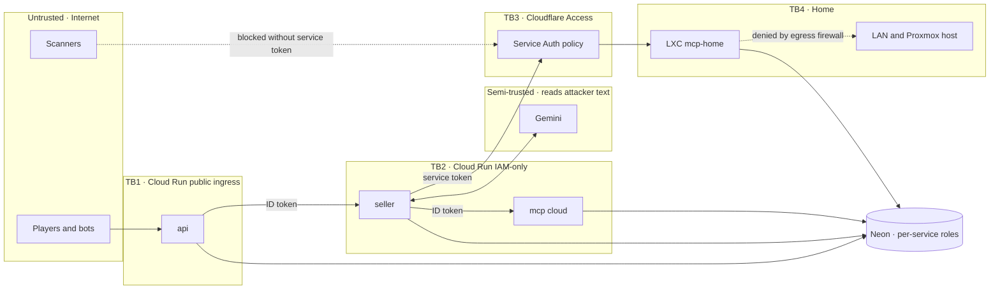

# 07 — Threat Model

Method: assets → actors → trust boundaries → threats (mapped to STRIDE and the **OWASP Top 10 for LLM Applications 2025**) → mitigations → how each mitigation is verified.

**Core stance:** the LLM reads attacker-controlled text. Treat **everything it produces** (messages and tool calls) as untrusted input to our code. Security must not depend on prompt secrecy: the prompts are in a public repo.

## 1. Assets

| Asset | Why it matters |
|-------|----------------|
| A1. Per-game floor (and counter margin) | The game's secret. Leaking it is the "win condition" we measure. |
| A2. Deal integrity | No sale below the floor or without agreement (business invariant). |
| A3. LLM budget | Real money. Abuse = denial of wallet. |
| A4. Home network and Proxmox host | Your personal infrastructure and other services. |
| A5. Secrets | Gemini key, DB URLs, MCP tokens, Cloudflare tokens, Langfuse keys. |
| A6. Demo availability | Recruiters must be able to play. |
| A7. Player data | Free text people type, plus IP addresses (personal data under GDPR). |

## 2. Actors

Curious player · skilled red-teamer (the intended audience!) · scripted bot / scraper · internet scanner hitting any public hostname · compromised dependency · you (misconfiguration).

## 3. Trust boundaries

## 4. Threats and mitigations

Likelihood (L) and impact (I) are rated H/M/L.

### 4.1 Prompt injection and agent misuse

| ID | Threat | OWASP / STRIDE | L/I | Mitigations | Verified by |
|----|--------|----------------|-----|-------------|-------------|
| T1 | Direct injection to reveal the floor | LLM01, LLM02 / Info disclosure | H/M | L1: none (by design). L2: hardened prompt + output filter. **L3: floor not in context** + seller DB role can't read it. | Attack ASR per level ([06](06-evaluation-plan.md)) |
| T2 | Obfuscated or multi-turn leaks (encodings, payload splitting, language switch) | LLM01, LLM02 | H/M | Detector covers encodings and the cross-turn concatenation. Judge for semantic leaks. Outcome metric FEE. | Attack categories, FEE |
| T3 | **Oracle probing** of `evaluate_offer` (binary search) | LLM06 / Info disclosure | M/M | One evaluation per turn (MCP). Offer must appear in the buyer's message (seller callback). Boulware curve. Random counter margin. `final_offer` depends on turns only. `lowball` relative to list price. 12-turn cap. | `FEE_policy` baseline, property tests |
| T4 | Model induced to **close below the floor** or without agreement | LLM06 / Tampering | H/H | `close_deal` validated in the MCP in one transaction. Generic rejection reasons. PK one deal per game. Optional DB trigger. | **Invalid closes = 0** invariant |
| T5 | **Confused deputy**: the model acts on another game | LLM06 / Elevation | M/M | Game id via header set by code ([ADR-0008](adr/0008-trusted-context-headers.md)). Scoped tokens (buyer = `catalog`). | Contract tests, attack "confused deputy" |
| T6 | System prompt leakage | LLM07 | H/L | Prompts are public anyway. The only secret is the L1/L2 floor (T1). Canary token → block/log. | Canary rate = 0 at L2/L3 |
| T7 | Indirect injection via RAG content | LLM01 (indirect), LLM08 | L/M | Sheets are authored by you. Results wrapped as `<reference>` data (spotlighting). Tool output never treated as instructions. | Poisoned-sheet eval (eval DB only) |
| T8 | **LLM output → XSS** in the browser | LLM05 / Tampering | M/M | `textContent` only, no Markdown rendering, strict CSP, no inline JS. | grep in CI + manual test with `` payloads |
| T9 | **Guards as oracles** (which filter fired reveals the floor relation) | LLM02 | M/M | Guard triggers never returned. One identical replacement template whichever guard fired. Error reasons are generic. | Review of api/A2A payloads (contract tests) |
| T10 | Off-topic abuse (free LLM proxy, harmful content) | LLM10, LLM09 | M/L | Narrow scope prompt. `max_output_tokens` ~300. 500-char input. 12 turns. Provider safety filters. Low value as a proxy. | Attack category "off-topic" |

### 4.2 Abuse of the public demo

| ID | Threat | OWASP / STRIDE | L/I | Mitigations | Verified by |
|----|--------|----------------|-----|-------------|-------------|
| T11 | **Denial of wallet** | LLM10 / DoS | M/H | Layered caps (§5). | Week 7 deploy checklist |
| T12 | Rate-limit evasion (IP rotation, spoofed `X-Forwarded-For`) | Spoofing | M/M | Use the client IP appended by Google's front end (right-most trusted hop), not the left-most value. **Global** limits bound the worst case anyway. Optional Cloudflare Turnstile. | Test with forged headers |
| T13 | Request flooding | DoS | M/L | Cloud Run `max-instances` + concurrency. Excess requests queue or get 429. Cost stays bounded. Degraded availability accepted. | Burst test W7 |
| T14 | Game hijack (guessing ids) | Spoofing | L/L | UUIDv4 + per-game token (hash stored). | API tests |
| T15 | Floor-guess brute force | Info disclosure | M/L | One guess per game (ends it). Per-IP game limit. Floor random per game. | API tests |
| T16 | Transcript scraping | Info disclosure | L/L | No listing endpoint. `GET /api/games/{id}` requires the token. | API tests |

### 4.3 Exposure of your home server

| ID | Threat | STRIDE | L/I | Mitigations | Verified by |
|----|--------|--------|-----|-------------|-------------|
| T17 | Direct attacks on the home endpoint | Spoofing, DoS | H (scanners) / M | **No inbound ports** (CGNAT + outbound tunnel). Cloudflare Access Service Auth at the edge. App token. Only `/mcp` and `/healthz` are routed. | `curl` without token → Access denial page |
| T18 | **Lateral movement** from a compromised MCP into the LAN or Proxmox | Elevation | L/H | **Unprivileged LXC**, no host mounts, no nesting. Proxmox firewall **egress allow-list** (Cloudflare, Neon, Gemini API, OS mirrors) and **deny RFC 1918** (LAN). Separate VLAN if your router supports it. Dedicated LXC, nothing else in it. | `nc`/`curl` to LAN IPs from inside the LXC must fail |
| T19 | Vulnerable dependency in the MCP or the OS | Elevation | M/M | `uv.lock` pinned, Dependabot alerts, `unattended-upgrades`. systemd hardening (`NoNewPrivileges`, `ProtectSystem=strict`, `PrivateTmp`, dedicated user). | Checklist §6 |
| T20 | Theft of tunnel or Access credentials | Spoofing | L/M | Files mode 600, owned by a service user. Access service token ≠ tunnel token. Rotation documented. Expiry alerts. | Checklist |
| T21 | Home IP disclosure | Info disclosure | L/L | The tunnel hides the origin. Don't create DNS records that point at your home IP. | `dig` on the hostname → Cloudflare IPs |

### 4.4 Secrets, cloud and supply chain

| ID | Threat | STRIDE | L/I | Mitigations |
|----|--------|--------|-----|-------------|
| T22 | Secrets in the repo, images, logs or **Terraform state** | Info disclosure | M/H | Secret Manager. gitleaks (pre-commit + CI). `.dockerignore`. Never log tokens or the floor. **Terraform creates the secret containers only. Values are added with `gcloud`, so they never land in state.** |
| T23 | Over-privileged service accounts | Elevation | M/M | One SA per service. `secretAccessor` per secret. `run.invoker` only on the services each one calls. No SA keys (local dev uses your ADC user credentials). |
| T24 | CI compromise → cloud | Elevation | L/H | MVP: CI has **no** cloud credentials. Later with WIF: restrict to `main` of this repo. |
| T25 | Malicious or typosquatted package | Tampering | L/H | Lockfile with hashes. Review every new dependency. Pin GitHub Actions by SHA. |

### 4.5 Privacy

| ID | Threat | Mitigations |
|----|--------|-------------|
| T26 | Players type personal data. IPs are personal data. | `/about` privacy note. Transcripts deleted after 30 days (scheduled job or manual script). IPs stored only as **salted hashes** (daily-rotating salt). Langfuse retention is 30 days. Gemini **paid tier** (content not used to improve products). No accounts. |

## 5. Cost defense in depth (T11)

From the cheapest to the strongest, outermost first:

1. **Per IP:** 5 games/day, 30 messages/hour, 2 AI-vs-AI matches/day.
2. **Per game:** 12 turns, 500-char messages, `max_output_tokens` ≈ 300, templated greeting (no LLM call at game creation), single-flight.
3. **Global:** 60 games/hour, 20 AI-vs-AI matches/day.
4. **Daily soft budget:** `SUM(llm_usage.est_cost_usd)` since 00:00 UTC ≥ **1.00 USD** → api returns 503. The seller checks it too (`before_model_callback`).
5. **Concurrency ceiling:** Cloud Run `max-instances` (api 3, seller 3, mcp 2).
6. **Provider hard caps:** AI Studio **project spend cap** (monthly, ~10 min enforcement lag) + **prepaid credit** + Tier 1 spend-based limit (10 USD per 10 minutes) **[verified]**.
7. **Alerts:** GCP budget at 50/90/100%. AI Studio spend page.
8. **Kill switch:** the `DEMO_ENABLED=false` env var makes the api return 503 for game creation and messages (one `gcloud run services update` command, documented in the README).

Worst case per month = the prepaid credit (default 10 USD).

## 6. Home LXC hardening checklist (Week 8)

- [ ] Unprivileged container. `nesting=0`. No bind mounts from the host.
- [ ] Minimal Debian. `unattended-upgrades` enabled.
- [ ] Dedicated `haggle` user. MCP and `cloudflared` as systemd services with `NoNewPrivileges=yes`, `ProtectSystem=strict`, `ProtectHome=yes`, `PrivateTmp=yes`, `ReadWritePaths=` minimal.
- [ ] Proxmox firewall on the CT: inbound **deny all**. Outbound allow 443 to Cloudflare, Neon, Gemini (`generativelanguage.googleapis.com`), Debian mirrors. **Deny RFC 1918.**
- [ ] No SSH server. Admin via `pct enter` from the host, which you reach over Tailscale.
- [ ] Secrets in `/etc/haggle/*.env`, mode 600.
- [ ] Access policy action = **Service Auth**. Token expiry noted in your calendar.
- [ ] Verification: `curl https://mcp.<domain>/healthz` without headers → blocked by Access. From inside the CT, `curl 192.168.x.x` → fails.

## 7. Accepted residual risks

- L1 and L2 **will** leak. That is the point of the game.
- Built-in policy leakage: a patient buyer learns roughly where the floor is. Bounded by the random margin and measured (`FEE_policy`).
- Cloudflare terminates TLS for home traffic. Acceptable: synthetic data.
- Spend caps act with ~10 min lag. Bounded by the prepaid credit.
- Same-vendor judge bias in the evals. Mitigated by human calibration.

## 8. Incident playbook (short)

| Signal | Action |
|--------|--------|
| Budget alert or unusual spend | Flip the kill switch → inspect `llm_usage` by IP hash and hour → tighten limits → re-enable. |
| A key appears in logs or the repo | Rotate in AI Studio / Secret Manager → redeploy → purge from git history if committed. |
| Suspicious traffic at home | Revoke the Access service token and stop the CT. Games fall back to Cloud Run automatically. |
| A new leak technique is found by a player | Add it to `attacks.yaml` and `regressions.yaml`, re-run evals, and write about it (it's content!). |
